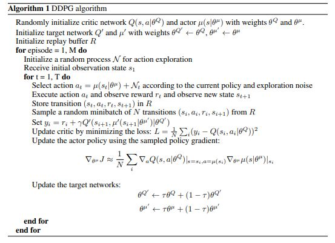
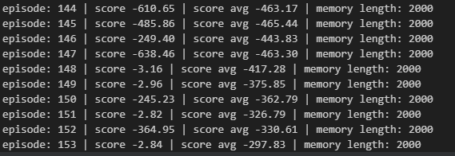
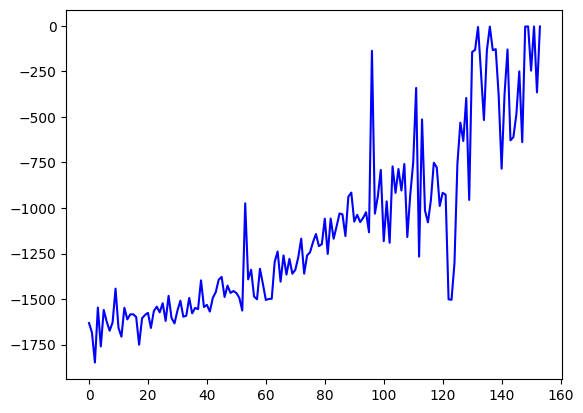
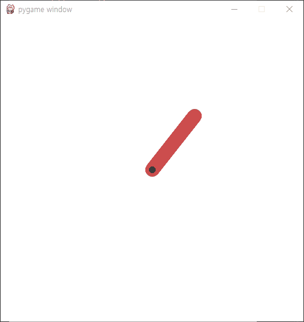

# Inverted Pendulum 강화학습

## 1. DDPG 개념
### 1.1. 문제인식
 - DQN을 이용하려면 각 action이 discrete하게 존재하여 이를 one-hot encoding을 통해 각각의 행동에 대한 확률을 NN을 통해 근사하는 방법이 있음 -> 문제 상황에 적합하지 않음( 연속적인 action space )

 - 이를 해결하기 위한 DDPG(Deep Deterministic Policy Gradient)라는 DQN을 활용한 Actor-Critic 방식으로 연속적인 환경에서 해당 action의 값 자체를 예측하도록 하는 방법을 사용



(알고리즘은 궁금한 사람은 참고하도록 하자)

### 1.2. DDPG의 구성
1. Actor 신경망

    현재 상태를 입력으로 받아 action을 결정하는 정책을 학습

2. Critic 신경망

   현재 상태와 선택한 Action을 입력으로 받아 Q 함수를 예측 (시간차 학습을 사용) -> Actor 신경망을 통해 선택된 액션에 대한 가치를 추정

3. Target Network

   각 Actor와 Critic에는 Target Network가 존재하고, 이는 DQN과 같이 학습의 안정성을 향상시키는 데 사용된다.

4. OU-Noise(Ornstein-Uhlenbeck Noise)

   평균으로 되돌아가는 특성을 지녀 액션값이 변하면서도 지속적인 탐색을 가능하도록 한다.

---
## 2. 코드 설명
### 2.1. import
``` python
import gymnasium as gym
import numpy as np
import matplotlib.pyplot as plt
import tensorflow as tf
from tensorflow.keras.models import Model
from tensorflow.keras.layers import Dense, Input, Lambda
from tensorflow.keras.optimizers import Adam
from tensorflow.keras.initializers import RandomUniform
import random
import os
import sys
from collections import deque
import pygame
```
필요한 라이브러리 import

---
### 2.2. Actor-Critic 신경망 선언
``` python
class Actor(tf.keras.Model):
    def __init__(self, action_dim, action_bound):
        super(Actor, self).__init__()
        self.action_bound = action_bound
        self.fc1 = Dense(64, activation='relu')
        self.fc2 = Dense(64, activation='relu')
        self.fc3 = Dense(action_dim, activation='tanh')  # -2.0 ~ 2.0 사이의 액션 값 반환

    def call(self, state):
        x = self.fc1(state)
        x = self.fc2(x)
        a = self.fc3(x)
        a = Lambda(lambda x: x*self.action_bound)(a)
        return a

class Critic(tf.keras.Model):
    def __init__(self):
        super(Critic, self).__init__()
        self.fc1 = Dense(64, activation='relu')
        self.fc2 = Dense(64, activation='relu')
        self.fc3 = Dense(1, activation='linear')

    def call(self, state, action):
        x = tf.concat([state, action], axis=-1)
        x = self.fc1(x)
        x = self.fc2(x)
        x = self.fc3(x)
        return x
        
        
        
```
Critic Network같은 경우 state와 action을 한꺼번에 받아서 처리하므로 이를 Concatenate해서 신경망 처리를 진행한다.

---
### 2.3. Agent Class
#### 2.3.1. Hyper parameter
``` python
def __init__(self, state_size, action_size):
        self.render = False
        self.state_size = state_size
        self.action_size = action_size
        self.action_bound = env.action_space.high[0]
        self.actor = Actor(action_size, self.action_bound)
        self.target_actor = Actor(action_size, self.action_bound)
        self.critic = Critic()
        self.target_critic = Critic()
        self.actor_optimizer = Adam(learning_rate=0.001)
        self.critic_optimizer = Adam(learning_rate=0.001)
        self.train_start = 1000
        self.gamma = 0.99
        self.tau = 0.001
        self.memory = deque(maxlen=2000)
        self.batch_size = 64
```
---
#### 2.3.2. 간단한 함수들
```python
    def get_action(self, state):
        action = self.actor(state)[0][0]
        return action
        
    def append_sample(self, state, action, reward, next_state, done):
        self.memory.append((state, action, reward, next_state, done))
    
    def ou_noise(self, x, rho=0.15, mu=0, dt=1e-1, sigma=0.2, dim=1):
        return x + rho*(mu - x)*dt + sigma*np.sqrt(dt)*np.random.normal(size=dim)
    
```
ou-noise 함수 식은 위와 같이 표현된다.

---
#### 2.3.3. Train Model
``` python
    def train_model(self):
        
        mini_batch = random.sample(self.memory, self.batch_size)
        states = np.array([sample[0][0] for sample in mini_batch])
        actions = np.array([sample[1] for sample in mini_batch])
        rewards = np.array([sample[2] for sample in mini_batch])
        next_states = np.array([sample[3][0] for sample in mini_batch])
        dones = np.array([sample[4] for sample in mini_batch])
        actions = np.reshape(actions, [-1, 1])
        next_actions = self.target_actor(next_states)
        next_actions = np.reshape(next_actions, [-1, 1])
        q_values = self.target_critic(next_states, next_actions)
        targets = rewards + self.gamma * q_values * (1 - dones)

        with tf.GradientTape() as tape:
            q_values = self.critic(states, actions)
            critic_loss = tf.reduce_mean(tf.square(q_values - targets))

        critic_grads = tape.gradient(critic_loss, self.critic.trainable_variables)
        self.critic_optimizer.apply_gradients(zip(critic_grads, self.critic.trainable_variables))

        with tf.GradientTape() as tape:
            actions = self.actor(states)
            q_values = self.critic(states, actions)
            actor_loss = -tf.reduce_mean(q_values)

        actor_grads = tape.gradient(actor_loss, self.actor.trainable_variables)
        self.actor_optimizer.apply_gradients(zip(actor_grads, self.actor.trainable_variables))

        self.update_target_networks(self.tau)
```
사실상 앞서 했던 mountain car과 구조는 거의 흡사하다. 다만 Actor, Critic network에 대해 각각 gradient를 계산하여 업데이트를 진행하는 것을 볼 수 있다.

---
#### 2.3.4. target network update
``` python
    def update_target_networks(self, tau):
        actor_weights = self.actor.get_weights()
        target_actor_weights = self.target_actor.get_weights()
        critic_weights = self.critic.get_weights()
        target_critic_weights = self.target_critic.get_weights()

        for i in range(len(actor_weights)):
            target_actor_weights[i] = tau * actor_weights[i] + (1 - tau) * target_actor_weights[i]

        for i in range(len(critic_weights)):
            target_critic_weights[i] = tau * critic_weights[i] + (1 - tau) * target_critic_weights[i]

        self.target_actor.set_weights(target_actor_weights)
        self.target_critic.set_weights(target_critic_weights)
```
각 Network의 가중치를 받아와 tau를 이용하여 target network와 일반 network를 가중치를 부여한 형태로 업데이트하는 것을 볼 수 있다.

---
### 2.4. Main
``` python
if __name__ == "__main__":
    env = gym.make('Pendulum-v1', g = 10)
    state_size = env.observation_space.shape[0]
    action_size = env.action_space.shape[0]
    
    agent = Agent(state_size, action_size)
    
    scores, episodes = [], []
    score_avg = 0
    
    num_episode = 1000
    agent.update_target_networks(1.0)
    for e in range(num_episode):
        done= False
        score = 0
        state = env.reset()[0]
        state = np.array([state])
        pre_noise = np.zeros(action_size)
        
        
        
        while not done:
            if agent.render==True and e % 10 == 0:
                env.render()
                
            action = agent.get_action(state)
            noise = agent.ou_noise(pre_noise, dim=action_size)
            action = np.clip(action + noise, -2, 2)
            next_state, reward, _, done, _ = env.step((action,))
            
            next_state = np.reshape(next_state, [1, state_size])
            
            score += reward[0]
            # print(state)
            agent.append_sample(state, action, reward, next_state, done)
            if len(agent.memory) >= agent.train_start:
                agent.train_model()
                
            state = next_state
            
            if done:
                pre_noise = noise
                scores.append(score)
                episodes.append(e)
                score_avg = 0.9 * score_avg + 0.1 * score if score_avg != 0 else score
                print("episode: {:3d} | score {:3.2f} | score avg {:3.2f} | memory length: {:4d}".format(
                    e, score, score_avg, len(agent.memory)))


                
                if score_avg > -300:
                    #save model
                    agent.actor.save_weights("./save_model/model", save_format="tf")
                    sys.exit()
```
이것도 기존에 했던 과정과 매우 흡사하다. environment에 맞게 shape를 다듬는 과정이 살짝 다르고, 여기서 주목해야할 부분은 action 값을 근사하여 noise값과 더하여 action의 범주에 맞게 clip한 과정이다. 

그렇게 학습을 진행하였을 때 153개의 episode만에 평균 -300 이상을 도달하는데 성공하는 것을 볼 수 있었다.



---

## 3. test
최종적으로 평균 점수가 -300점을 넘게 되면 가중치를 저장하게 되고, 그 가중치를 load해서 테스트를 진행하게 된다. 
```python
# play saved model
agent.actor.load_weights("./save_model/model")
agent.epsilon = 0.01
env = gym.make('Pendulum-v1', g = 10, render_mode = 'human')
plt.plot(episodes, scores, 'b')
plt.show()

for e in range(5):
    
    done = False
    score = 0
    state = env.reset()[0]
    state = np.array([state])
    
    while not done:
        env.render()
        action = agent.get_action(state)
        next_state, reward, _, done, _ = env.step((action,))
        next_state = np.reshape(next_state, [1, state_size])
                
        score += reward
        state = next_state
        if done:
            print("episode: {:3d} | score: {:3f}".format(e, score))
pygame.quit()
env.close()
```

에피소드별 score은 다음과 같다




그렇게 진행하게되면 아래와 같이 학습된 모습을 볼 수 있다.



