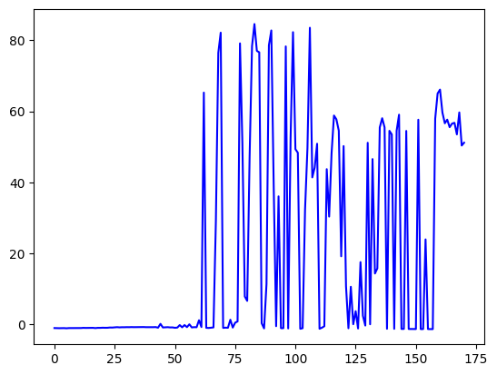

# Mountain Car 강화학습

## 1. import
``` python
import gymnasium as gym
import numpy as np
import matplotlib.pyplot as plt
import tensorflow as tf
from tensorflow.keras.models import Model
from tensorflow.keras.layers import Dense, Input
from tensorflow.keras.optimizers import Adam
from tensorflow.keras.initializers import RandomUniform
import random
import os
import sys
from collections import deque
```
필요한 라이브러리 import

## 2. Deep learning network
``` python
class DQN(tf.keras.Model):
    def __init__(self, action_size):
        super(DQN, self).__init__()
        self.fc1 = Dense(24, activation='relu')
        self.fc2 = Dense(24, activation='relu')
        self.fc_out = Dense(action_size,
                            kernel_initializer=RandomUniform(-1e-3, 1e-3))

    def call(self, x):
        x = self.fc1(x)
        x = self.fc2(x)
        q = self.fc_out(x)
        return q
```
3개의 층으로 구성하였으며, 입력에는 state를 받고 출력으로는 action의 확률값을 출력한다.

action은 앞, 뒤, 가만히 있는 세가지 상황을 가진다(discrete)

## 3. DQN Agent
### 3.1 hyper parameter
``` python
def __init__(self, state_size, action_size):
        self.render = True
        self.state_size = state_size
        self.action_size = action_size
        self.epsilon = 1.0
        self.epsilon_decay = 0.999
        self.epsilon_min = 0.01
        self.batch_size = 64
        self.train_start = 1000
        self.discount_factor = 0.99
        self.learning_rate = 0.001
        self.memory = deque(maxlen=2000)
        self.model = DQN(action_size)
        self.target_model = DQN(action_size)
        self.optimizer = Adam(learning_rate=self.learning_rate)
        self.update_target_model()
```

리플레이 메모리를 활용하였으며 메모리 캐시는 deque를 이용하였다. 앞서했던 cartpole과 형식은 매우 유사하다.

### 3.2 target model update
```python
def update_target_model(self):
        self.target_model.set_weights(self.model.get_weights())
```
타겟 모델을 업데이트하게 되는데, 모델의 가중치를 받아와 타겟모델을 업데이트한다.

### 3.3 get action
```python
def get_action(self, state):
        if np.random.rand() <= self.epsilon:
            return random.randrange(self.action_size)
        else:
            q_value = self.model(state)
            return np.argmax(q_value[0])
```
일반적으로 사용하는 epsilon-greedy 방식을 채택하였다.

### 3.4 append sample
```python
def append_sample(self, state, action, reward, next_state, done):
        self.memory.append((state, action, reward, next_state, done))
```

### 3.5 train model
``` python
def train_model(self):
        if self.epsilon > self.epsilon_min:
            self.epsilon *= self.epsilon_decay
            
        mini_batch = random.sample(self.memory, self.batch_size)

        states = np.array([sample[0][0] for sample in mini_batch])
        actions = np.array([sample[1] for sample in mini_batch])
        rewards = np.array([sample[2] for sample in mini_batch])
        next_states = np.array([sample[3][0] for sample in mini_batch])
        dones = np.array([sample[4] for sample in mini_batch])
```
입실론 값을 계속해서 줄여나가면서 메모리에서 샘플링을 진행한다.
batch size는 64로, 메모리에서 해당 배치 사이즈만큼 랜덤으로 샘플을 추출한다.
minibatch에서 나오는 sample의 shape에 주의하며 필요없는 값이 나오지 않는지 고려해야한다.

```python
        model_params = self.model.trainable_variables
        with tf.GradientTape() as tape:
            predicts = self.model(states)
            
            one_hot_action = tf.one_hot(actions, self.action_size)
            predicts = tf.reduce_sum(one_hot_action * predicts, axis=1)            
            
            target_predicts = self.target_model(next_states)
            target_predicts = tf.stop_gradient(target_predicts)
            
            max_q = np.amax(target_predicts, axis=-1)
            targets = rewards + (1 - dones) * self.discount_factor * max_q
            loss = tf.reduce_mean(tf.square(targets - predicts))

        grads = tape.gradient(loss, model_params)
        self.optimizer.apply_gradients(zip(grads, model_params))
```
가중치를 구하기 위해서는 해당 모델의 gradient를 구해야한다. 이를 위해 tf.GradientTape를 활용하였고, 기존에 샘플링한 정보가 여기서 사용된다.

1. neural network에 state값이 들어가게된다.
2. 출력값인 action의 예측값을 반환한다. 여기서 states는 (64, )의 배치사이즈와 동일한 크기이고, predicts는 (64, 3)의 크기를 가진다.
3. one_hot_action을 통해 샘플링 한 해당 state일 때의 action을 one-hot encoding 한다. 마찬가지로 (64, 3)의 크기를 지닌다.
one_hot encoding을 진행하면 다음과 같은 형태를 가진다.
```
[[0., 1., 0.],
[0., 0., 1.]
.
.
.
[1., 0., 0.]]
```


4. predicts값과 one_hot_action을 곱하게 된다. 
5. target model을 이용하여 target_predict를 구하게 된다. 이는 q value의 가공을 거쳐 targets값으로 계산된다.
6. target model은 next_states를 기준으로 업데이트 시킨다. loss는 y hat에 y를 뺀 값이므로 target - predict의 형태로 reduce_mean을 구한다. 
7. 최종적으로 gradient는 loss를 기준으로 model_parameter를 반영하여 grads로 업데이트된다. optimizer를 거쳐 gradient값이 적용되게 된다.

## 4. main
### 4.1 environment 
```python
env = gym.make('MountainCar-v0', render_mode='human')
    state_size = env.observation_space.shape[0]
    action_size = env.action_space.n
    
    agent = Agent(state_size, action_size)
    
    scores, episodes = [], []
    score_avg = 0
    
    num_episode = 1000
```
기본적인 렌더링과 metric를 위한 설정
episode의 최대 수는 1000으로 지정하였다.

### 4.2 episode loop
```python
for e in range(num_episode):
        done= False
        score = 0
        state = env.reset()[0]
        state = np.reshape(state, [1, state_size])

        while not done:
            if agent.render and e % 10 == 0:
                env.render()
            action = agent.get_action(state)
            next_state, reward, _, done, _ = env.step(action)
            next_state = np.reshape(next_state, [1, state_size])

            # 수정된 보상 계산
            if next_state[0, 0] >= 0.5:
                reward = 1  # 목표 지점에 도달한 경우
            else:
                if next_state[0, 0]<0:
                    reward = next_state[0, 0]*0.01
                else:
                    reward = next_state[0, 0]*0.5 # 실패한 경우
                
                
            score += reward
            
            agent.append_sample(state, action, reward, next_state, done)
            if len(agent.memory) >= agent.train_start:
                agent.train_model()
                
            state = next_state
            
            if done:
                agent.update_target_model()

                score_avg = 0.9 * score_avg + 0.1 * score if score_avg != 0 else score
                print("episode: {:3d} | score {:3.2f} | score avg {:3.2f} | memory length: {:4d} | epsilon: {:.4f}".format(
                    e, score, score_avg, len(agent.memory), agent.epsilon))


                
                if score_avg > 90:
                    #save model
                    agent.model.save_weights("./save_model/model", save_format="tf")
                    sys.exit()
```
메모리가 1000개 이상일 때 부터 train을 시작하게끔 하였다. 
주의해야 할 점은 현재 env.reset()값은 형식이 ([0.123123, 0.412412], {})로 지정되어있어 첫 번째 값을 따로 가져와야한다. 따라서 state는 env.reset[0]으로 지정한다.
주목해야할 부분은 보상을 산정하는 방식인데, 먼저 성공 조건에 도달하게 되면 3의 보상을 받고, 도달하지 않았을 경우 차의 위치를 양수, 음수일때로 구분한다.
여기서 x좌표가 어떻게 출력되는지에 대한 이해가 필요한데, min = -1.2 max = 0.6이다. 이는 즉 음수 방향의 위치가 더 크다는 뜻이다. 따라서 음수일 경우에 적은 가중치를 부여하고, 위치가 양수일 경우에는 더 큰 가중치를 부여하여 뒤로 가더라도 가속도에 의해 더 멀리 갈 수 있어 전체적인 보상은 더 크게 나오게 된다.

## 5. test
최종적으로 평균 점수가 90점을 넘게 되면 가중치를 저장하게 되고, 그 가중치를 load해서 테스트를 진행하게 된다. 
```python
# play saved model
agent.model.load_weights("./save_model/model")
agent.epsilon = 0.01

plt.plot(episodes, scores, 'b')
plt.show()

for e in range(5):
    
    done = False
    score = 0
    state = env.reset()[0]
    state = np.reshape(state, [1, state_size])
    
    while not done:
        env.render()
        action = agent.get_action(state)
        next_state, reward, _, done, _ = env.step(action)
        next_state = np.reshape(next_state, [1, state_size])
        if next_state[0, 0] >= 0.5:
                reward = 1  # 목표 지점에 도달한 경우
        else:
            if next_state[0, 0]<0:
                reward = next_state[0, 0]*0.01
            else:
                reward = next_state[0, 0]*0.1 # 실패한 경우
                
        score += reward
        state = next_state
        if done:
            print("episode: {:3d} | score: {:3f}".format(e, score))
```
에피소드별 score은 다음과 같다



그렇게 진행하게되면 아래와 같이 학습된 모습을 볼 수 있다.


